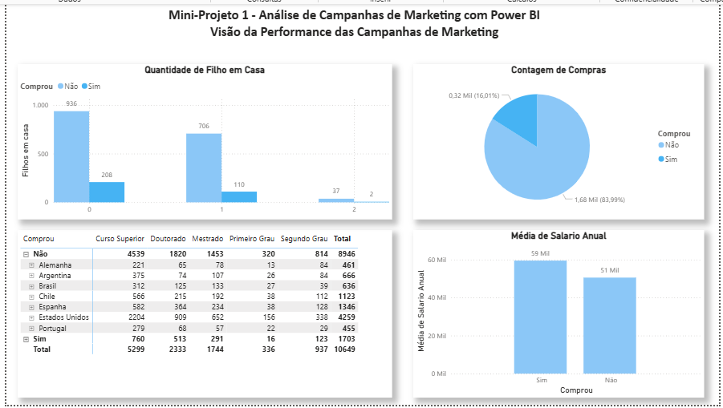
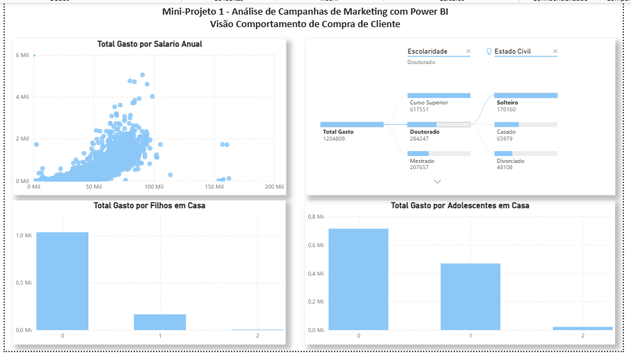
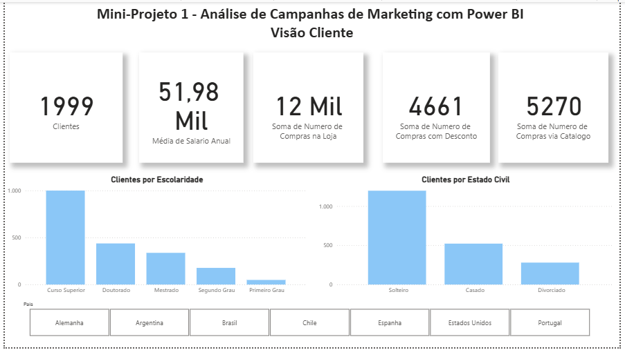
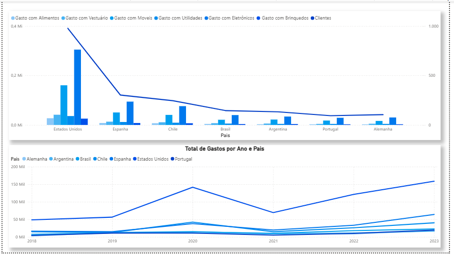

# 📊 Mini-Projeto 1 - Análise de Campanhas de Marketing com Power BI

Este projeto apresenta um dashboard abrangente desenvolvido em Microsoft Power BI, focado na análise de dados de campanhas de marketing e comportamento de compra do cliente. Ele explora como diferentes fatores demográficos e de consumo impactam o sucesso das campanhas.

## Objetivo:

O principal objetivo é fornecer insights sobre o perfil do cliente que respondeu às campanhas, identificar padrões de gastos por categoria de produto e por país, e correlacionar dados demográficos (como número de filhos, escolaridade e estado civil) com o comportamento de compra.

## Fonte dos Dados:

Dados fictícios de clientes e campanhas de marketing, contendo informações demográficas, históricos de compra e gastos por categoria de produto.

## Tecnologias e Ferramentas Utilizadas:

* **Microsoft Power BI Desktop:** Ambiente principal para o desenvolvimento do dashboard.
* **Power Query:** Utilizado para a conexão, limpeza, transformação e modelagem inicial dos dados, garantindo a integridade e a estrutura necessária para as análises.
* **DAX (Data Analysis Expressions):** Empregado para criar medidas e cálculos personalizados que enriquecem a análise, como "Média de Salário Anual", "Total Gasto por Salário Anual" e "Contagem de Compras".

## Principais Métricas e Visualizações:

Este dashboard é composto por múltiplas páginas, cada uma focada em uma dimensão da análise:

### Visão da Performance das Campanhas de Marketing:

* **Quantidade de Filho em Casa & Compra:** Gráficos de barras que correlacionam o número de filhos com a decisão de compra.
* **Contagem de Compras:** Gráfico de pizza mostrando a proporção de clientes que compraram vs. não compraram.
* **Média de Salário Anual:** Gráfico de barras comparando a média salarial entre compradores e não-compradores.
* **Tabela de Compradores por Escolaridade e País:** Detalhamento do perfil de compra.

### Visão Comportamento de Compra de Cliente:

* **Total Gasto por Salário Anual:** Gráfico de dispersão explorando a relação entre gastos totais e salário anual.
* **Total Gasto por Filhos em Casa & Adolescentes em Casa:** Gráficos de barras analisando o impacto do perfil familiar nos gastos.
* **Escolaridade & Estado Civil:** Visuais de árvore (treemap) mostrando a distribuição de gastos por esses fatores demográficos.

### Visão Cliente:

* **KPIs de Clientes:** Cartões mostrando o número total de clientes, média de salário anual, soma de compras na loja, compras com desconto e via catálogo.
* **Clientes por Escolaridade e Estado Civil:** Gráficos de barras que detalham a base de clientes por esses atributos.
* **Filtros por País:** Botões de segmentação para filtrar os dados por país de origem do cliente.

### Visão Total de Gastos por Categoria e Ano:

* **Total de Gastos por Categoria de Produto:** Gráfico de linhas/colunas combinadas que visualiza os gastos em diferentes categorias (Alimentos, Vestuário, Móveis, etc.) ao longo do tempo e por país.
* **Total de Gastos por Ano e País:** Gráfico de linhas mostrando a evolução dos gastos totais por ano, segmentado por país.

*Observação: O arquivo .pbix completo está disponível nesta pasta para download e exploração.*
