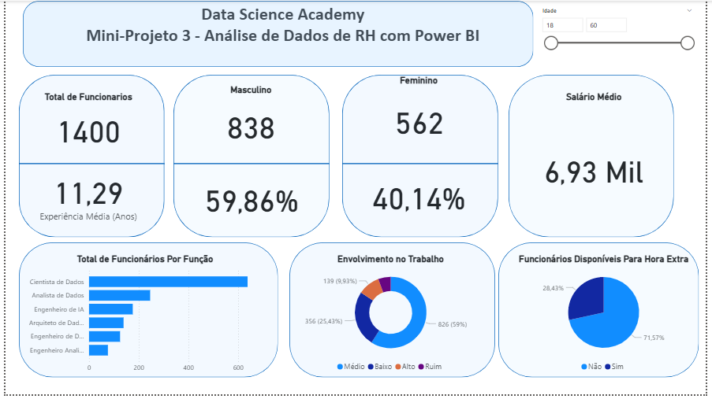

# 📊 Mini-Projeto 3 - Análise de Dados de RH com Power BI

Este dashboard interativo foi desenvolvido em Microsoft Power BI para fornecer uma visão analítica sobre a base de funcionários de uma empresa, com foco em métricas e perfis demográficos.

## Objetivo:

O principal objetivo é auxiliar a gestão de Recursos Humanos na tomada de decisões estratégicas, permitindo a compreensão de:
* O perfil da força de trabalho (total, por gênero, idade e experiência).
* A distribuição de funcionários por função.
* O nível de envolvimento e satisfação no trabalho.
* A disponibilidade de funcionários para horas extras.

## Fonte dos Dados:

Dados fictícios de RH, contendo informações sobre funcionários (identificador, gênero, idade, função, anos de experiência, nível de envolvimento e disponibilidade para hora extra).

## Tecnologias e Ferramentas Utilizadas:

* **Microsoft Power BI Desktop:** Ambiente principal para o desenvolvimento do dashboard.
* **Power Query:** Utilizado para a conexão, limpeza, transformação e modelagem inicial dos dados, garantindo a integridade e a estrutura necessária para as análises de RH.
* **DAX (Data Analysis Expressions):** Empregado para criar medidas e cálculos personalizados, como "Total de Funcionários", "Experiência Média (Anos)", "Salário Médio" e porcentagens por gênero.

## Principais Métricas e Visualizações:

* **Total de Funcionários, Masculino/Feminino e Salário Médio:** Cartões de KPIs para uma visão rápida dos números chave.
* **Total de Funcionários Por Função:** Gráfico de barras horizontais que mostra a distribuição da força de trabalho por diferentes cargos.
* **Envolvimento no Trabalho:** Gráfico de Rosca/Pizza que ilustra o nível de envolvimento dos funcionários (Médio, Baixo, Alto, Ruim).
* **Funcionários Disponíveis Para Hora Extra:** Gráfico de Rosca/Pizza que mostra a proporção de funcionários disponíveis para trabalhos adicionais.
* **Filtros Interativos:** Segmentadores de dados para filtrar a análise por faixa etária (Idade).

## Dashboard Interativo:

Abaixo, uma prévia do dashboard:

*Observação: O arquivo .pbix completo está disponível nesta pasta para download e exploração.*
